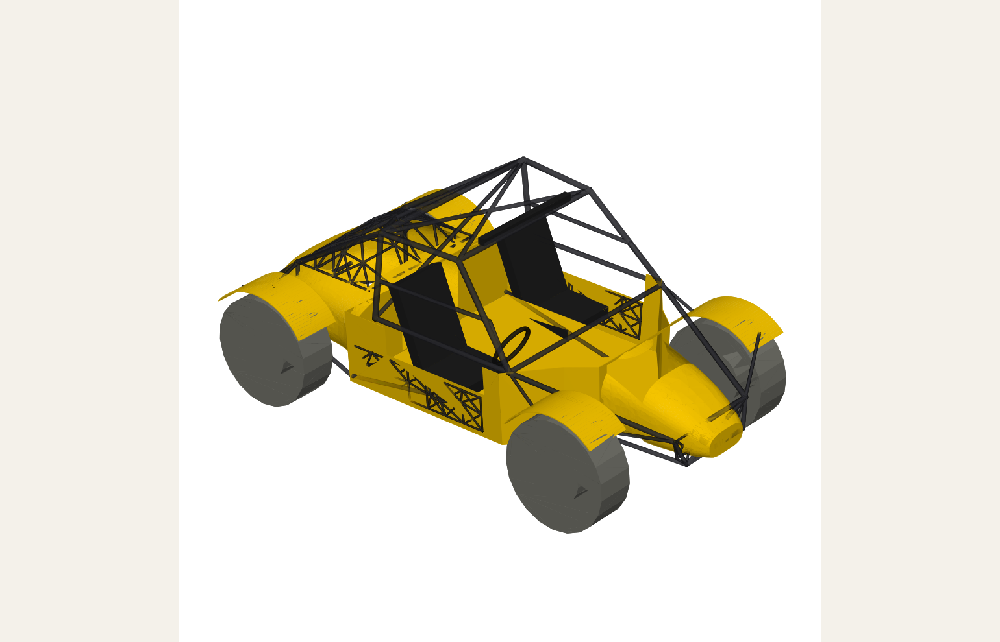
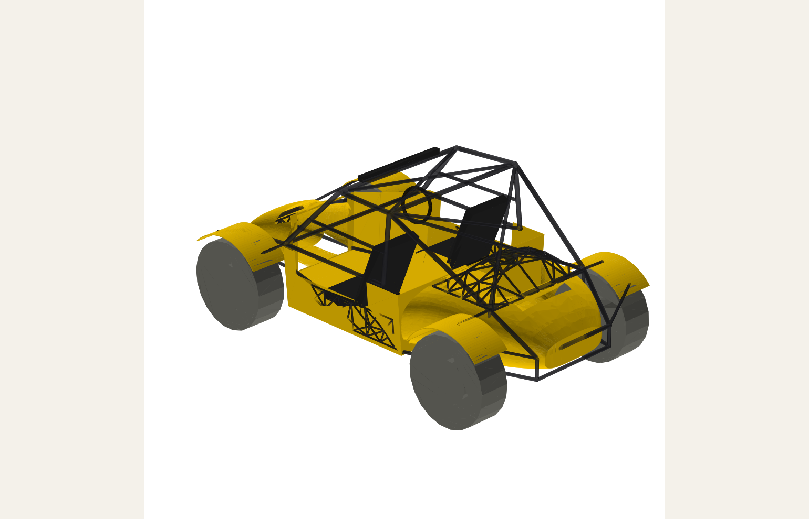
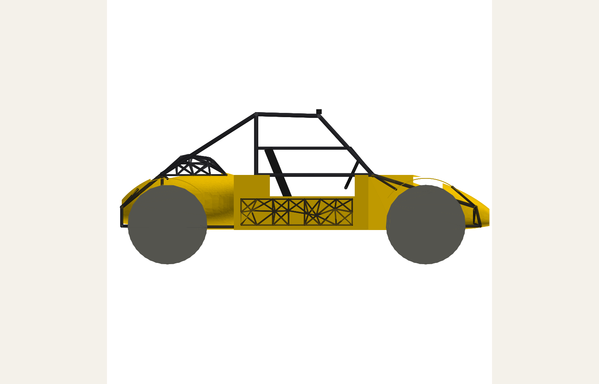
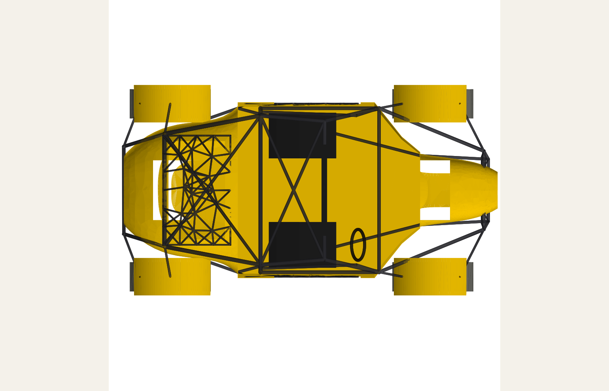

# Flattop Buggy - two-seat off-road body around the cp-proto-flattop chassis

An aggressive, open-wheel, two-seat off-road buggy body designed around the
existing **cp-proto-flattop** chassis spine (batteries, diesel range extender
and electric motors already fill the centre of the car). The body never
touches the spine: it is derived from the spine's measured envelope and cut
with a clearance channel wherever a skin would otherwise cross it.

| | |
|---|---|
|  |  |
|  |  |

Renders are from the cadquery reference build below with a placeholder
3200 x 600 x 550 mm spine. The Fusion script uses the real spine.

## What is in the folder

| File | Purpose |
|---|---|
| `buggy_geometry.py` | The design. Pure Python, mm, every dimension derived from the spine envelope, wheel package and occupant. Imported by both builders. |
| `fusion_buggy_body.py` | **Run this in Fusion.** Measures the open chassis, builds the body as a new `Buggy Body` component around it, writes `fusion_report.json`, exports STEP + F3D. |
| `run_via_socket.py` | Same build driven stage-by-stage through the Fusion360MCP socket add-in (optional). |
| `build_reference.py` | Cross-kernel reference: builds the identical geometry in cadquery/OpenCascade, exports STEP/STL, renders PNGs, writes `exports/reference_report.json`. |
| `exports/` | Renders and the reference volume report. The reference STEP/STL (60 MB) are not committed; `python build_reference.py` regenerates them in about a minute. |

## Run it in Fusion (3 minutes)

1. Open **cp-proto-flattop** in Fusion. Save it first (the build is one
   undoable component, but a save costs nothing).
2. Copy this folder anywhere on the workstation.
3. **Utilities > Add-Ins > Scripts and Add-Ins > Scripts > "+"** (green plus,
   *Script from device*) and pick `fusion_buggy_body.py`. Then **Run**.
4. A message box reports bodies built, key dimensions, the mass estimate and
   any stage that failed. `fusion_build.log` next to the script has the
   full trace, `fusion_report.json` the volumes, `exports/` the STEP and F3D.

Nothing in the existing design is modified. The whole body lives in one new
top-level component, `Buggy Body`, with sub-components `Cage`,
`Generative Lattice`, `Skins`, `Fittings`, `Reference Wheels` and `GD Setup`.
Delete that one component to undo everything.

### If it comes out wrong

Edit `CONFIG` at the top of `fusion_buggy_body.py`:

| Symptom | Setting |
|---|---|
| Nose at the wrong end of the chassis | `forward_sign = -1` |
| Body lying on its side | `up_axis = "Y"` or `"Z"` (the script reads the modelling-orientation preference, which may differ from the document) |
| Wrong ground height | `ground_clearance_mm` (distance from the spine belly to the ground) |
| Chassis has hidden or mesh bodies the script cannot measure | `chassis_bbox_mm = ((xmin, ymin, zmin), (xmax, ymax, zmax))` in document mm |
| Want it in a fresh document instead | `build_in_new_document = True` |
| Left-hand drive | `geometry_overrides = dict(driver_side="left")` |
| Slow lattice booleans | `union_lattices = False` |

Every design dimension (tyre size, track, seat pitch, tube sizes, skin
thickness, flank flare, lattice seed) is a key in
`buggy_geometry.DEFAULT_PARAMS` and can be overridden through
`geometry_overrides`. Re-run the script and delete the previous component.

### Socket add-in path

If the Fusion360MCP add-in is running (`localhost:9876`), `python
run_via_socket.py` on the workstation drives the same build one stage per
call and prints the verification summary; it needs no Scripts dialog.

## Design

Frame: +X forward, +Y left, +Z up, Z = 0 on the ground, origin at the middle
of the wheelbase. The script maps this onto the document (Y-up or Z-up,
longest horizontal axis of the chassis = forward) with one placement matrix
on the `Buggy Body` occurrence, so the geometry code never needs to know
how the chassis file is oriented.

Layout with the default spine:

| Item | Value |
|---|---|
| Wheelbase / track | 2880 / 1900 mm (wheelbase = 0.9 x spine length, min 2700) |
| Tyres | 35 x 12.5 on 17", open wheels with cycle fenders |
| Overall length / width / height | 4100 / 2220 / 1702 mm |
| Belly pan ground clearance | 386 mm |
| Seats | Two, either side of the spine, H-point ~660 mm, driver right (RHD) |
| Sill / roof rail height | 1000 / 1680 mm |

### Structure, built for strength and lightness

* **Roll cage (4130 chromoly, 44.5 x 2.4 hoops, 38 x 2.0 braces, 32 x 1.6
  diagonals).** A-hoop raked over the dash, B-hoop behind the seats, roof
  rails, rear stays to the deck, door bars, and front/rear nudge structure
  down to the bumpers and belly-pan corners. Every plane of the safety cell
  carries a diagonal (roof X, hoop Petty bar, rear-stay X, front X), so the
  cage is fully triangulated and load goes tube-to-tube, not through skins.
* **Generative strut lattices (3 zones).** Seeded nodes joined to their
  nearest neighbours within a cut-off, then tied to the cage hard points.
  This is the same "material only on the load path" outcome Fusion's
  Generative Design produces, kept parametric and reproducible (fixed seed):
  * *Side ribs*: exoskeleton web on the tub flanks between the floor tube and
    the sill, stiffening the largest flat panel and taking side impacts.
  * *Rear canopy*: a domed strut dome over the range-extender bay vent. It
    is the engine cover, the cooling vent and the rear rollover structure at
    once.
  * *Front grille*: organic web between the upper and lower bumper tubes.
* **Skins (4 mm CFRP shells).** Flared tub (ruled loft, floor to sill),
  raked nose (superellipse loft, shelled open at the dash), rear deck
  (superellipse loft, shelled open at the bulkhead, vent cut under the
  canopy) and four cycle fenders. They carry aero, splash and stone load
  only; the tubes carry the car.
* **Spine clearance.** A 30 mm channel around the measured spine is cut
  through every skin; the cage and lattices are positioned outside it by
  construction.

### Mass estimate (reference build)

| Group | kg |
|---|---|
| Cage (hollow 4130, analytical) | 78 |
| Lattices (hollow 4130, analytical) | 20 |
| CFRP skins (shell volume x 1.55 g/cc) | 50 |
| **Body total (no seats/wheels)** | **149** |

### Fusion Generative Design study inputs

The `GD Setup` sub-component (hidden bodies) contains the inputs to run a
real Generative Design study on the cage or gussets:

* **Obstacles**: spine envelope + 30 mm, two occupant zones, four wheel
  envelopes swept +/-150 mm of travel.
* **Preserves**: spherical pads at the twelve cage hard points (bumper
  nodes, A/B hoop feet, rear-stay feet).

Add loads at the preserves (3 g bump at the hoop feet, 1.5 g side at the
door bar, roof crush per the class rules), fix the bumper nodes, and let
the study grow the gusseting between the tubes.

## Verification

`build_reference.py` builds the same geometry in OpenCascade. After running
the Fusion script, compare `fusion_report.json` with
`exports/reference_report.json`: the per-body volumes should agree to well
under 1 percent for the same spine size (Fusion measures the real spine, so
set `spine_length/width/height` in `DEFAULT_PARAMS` to those values before
rebuilding the reference for an exact comparison).

```
python build_reference.py            # full build, ~2 min, STEP/STL/PNG/JSON
python build_reference.py --fast     # ~1 min, lattices left un-unioned
```

Requires `pip install cadquery matplotlib`.
